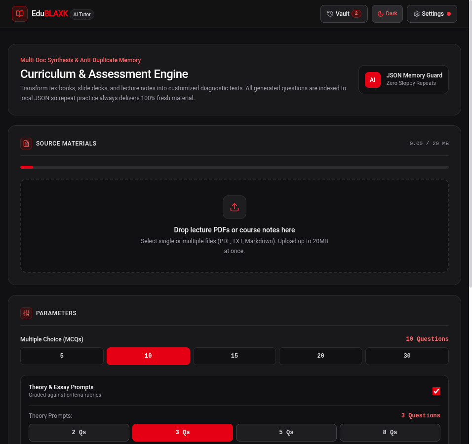
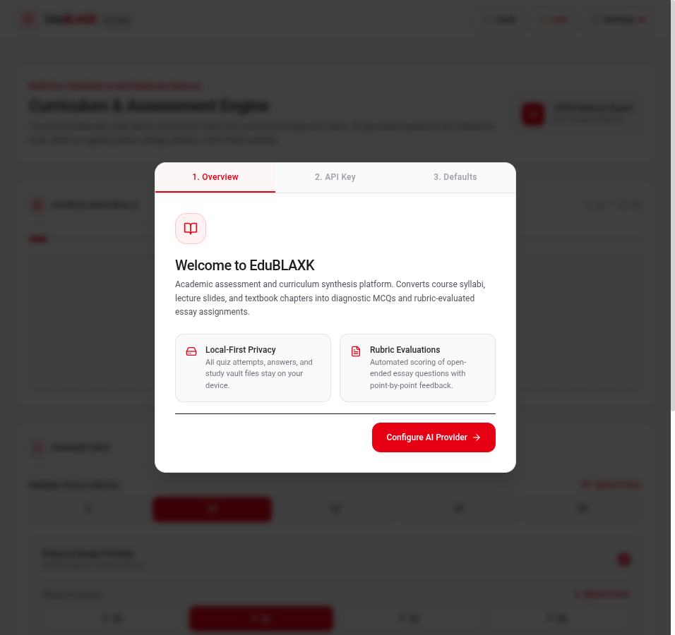
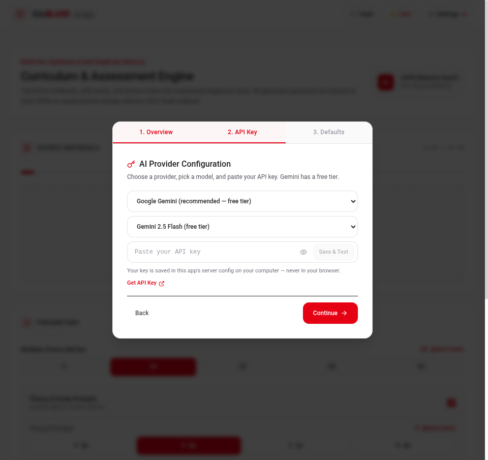
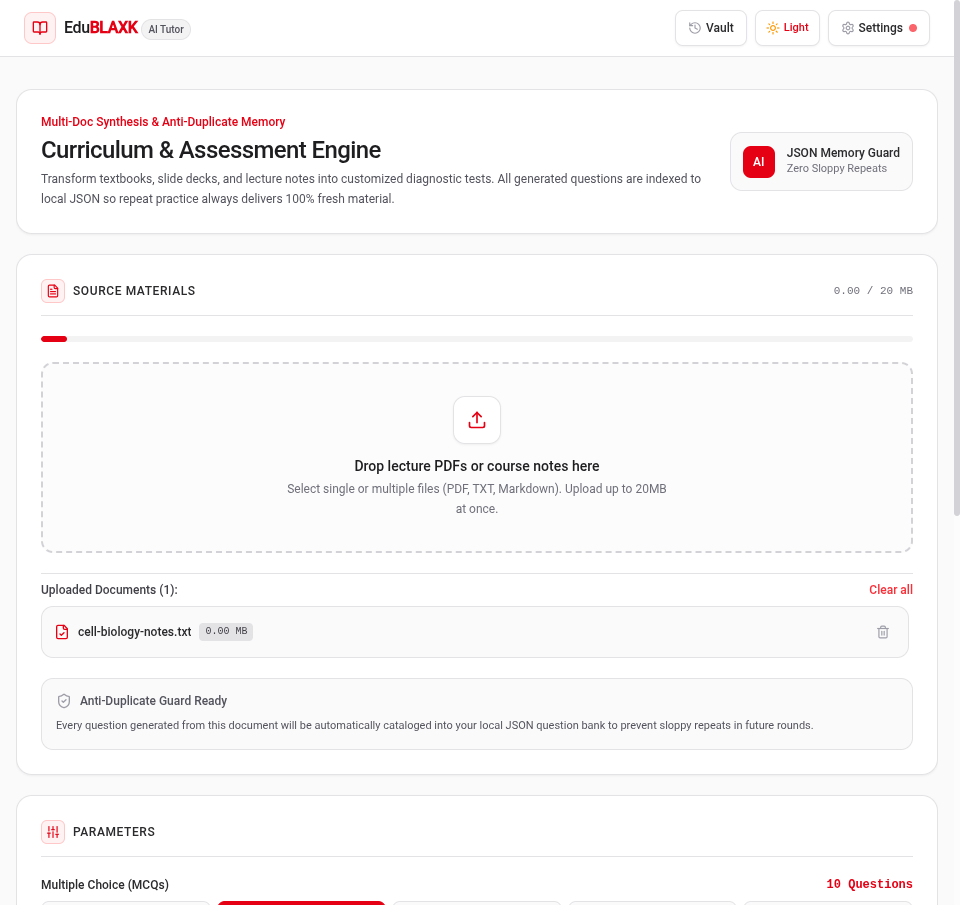
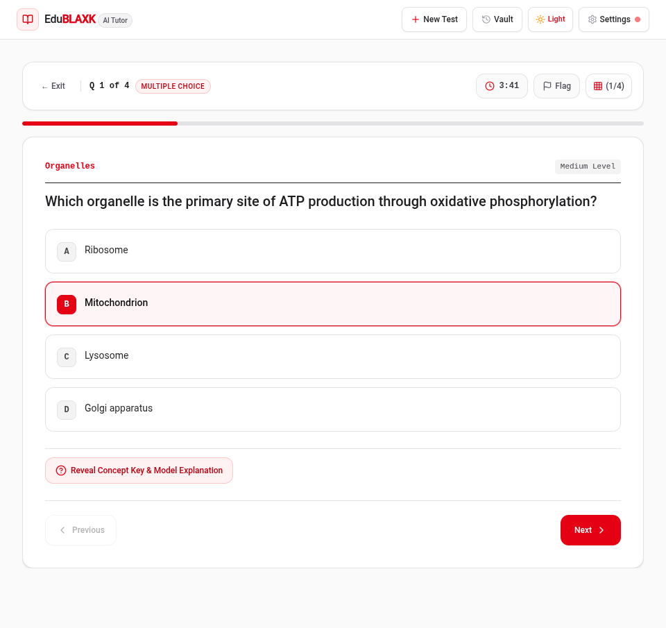
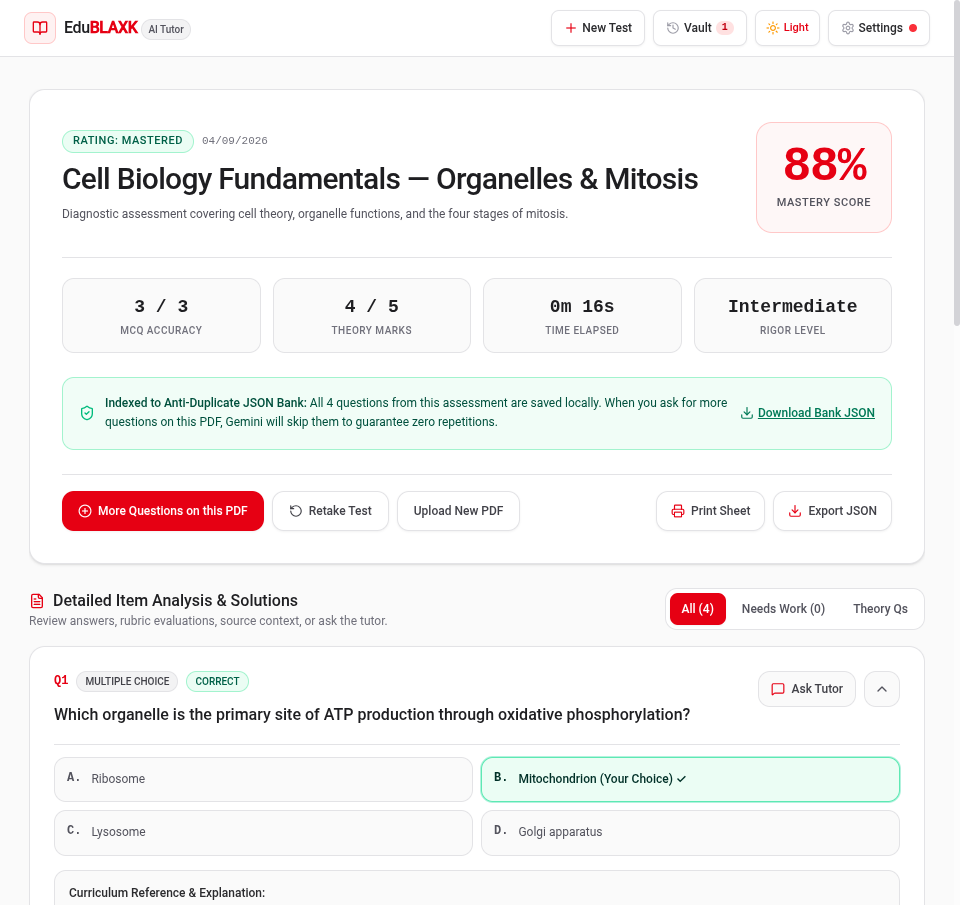
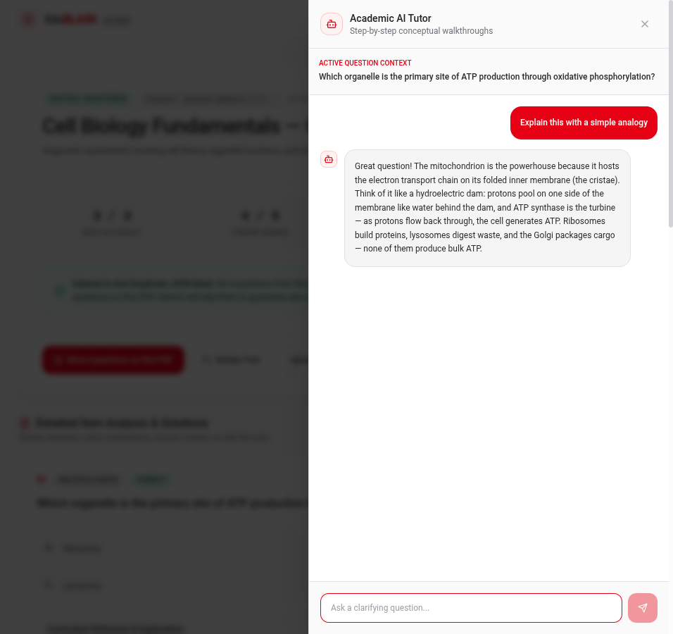
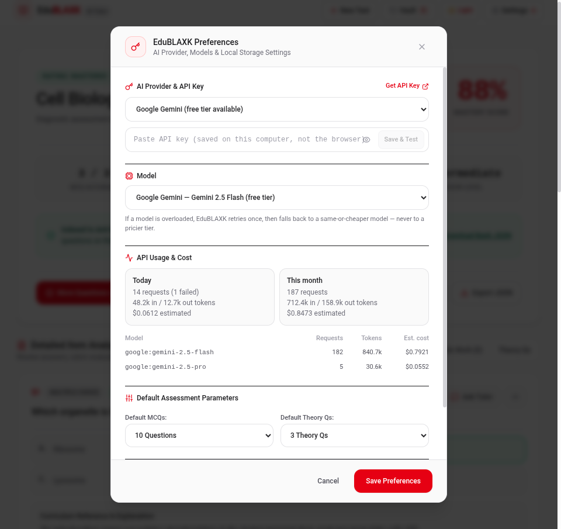

# EduBLAXK — Local AI Tutor & Assessment Engine

Turn textbooks, slide decks, and lecture notes into diagnostic MCQs and rubric-graded essay prompts — with an anti-duplicate question bank, a per-question AI tutor, and all student data kept on your machine.

EduBLAXK runs as a local app: an Express server holds your AI provider keys (they never enter the browser), while every attempt, answer, and generated question lives in your browser's localStorage. Repeat practice on the same document is guaranteed to serve **100% fresh questions** — past items are indexed into a local JSON bank and excluded from future generations.



## Screenshots

| Setup wizard — provider & key | Setup wizard — model pick |
| --- | --- |
|  |  |

**Build an assessment** — drop up to 20 MB of PDFs, TXT, or Markdown, pick MCQ/theory counts, rigor level, and practice vs. exam-simulation mode:



**Take it** — practice mode grades instantly with explanations; exam mode is timed and blind. Flag questions, track a per-question clock, and answer theory prompts against the rubric you'll be graded on:



**Results** — mastery score, MCQ accuracy, rubric-evaluated theory marks, and a per-question breakdown with model solutions, curriculum excerpts, and key points addressed/missed:



**Ask the tutor** — every question has a built-in AI tutor drawer for analogies, step-by-step walkthroughs, and "why is this correct?" explanations:



**History Vault** — all past attempts and the anti-duplicate question bank, searchable and filterable by mastery rating, with JSON export/import:


**Settings** — provider & key management, model catalog with pricing, live API usage/cost tracking with free-tier warnings, and default assessment parameters:



## Features

- **Multi-document synthesis** — upload several sources at once (PDF, TXT, MD, up to 20 MB); questions are drawn across all of them
- **MCQs + theory prompts** — multiple-choice questions with instant explanations, and essay questions graded against explicit rubric criteria by the AI
- **Anti-duplicate question bank** — every generated question is indexed to localStorage JSON; regeneration on the same document skips past items
- **Practice & exam modes** — instant-feedback practice or timed, blind exam simulation
- **Per-question AI tutor** — contextual chat drawer on every question
- **Multi-provider AI** — Google Gemini (free tier), Anthropic Claude, OpenAI; switch models per assessment
- **Tier-safe fallback** — if a model is overloaded or rate-limited, the server retries and falls back to a same-or-cheaper model, never a pricier tier
- **Usage & cost tracking** — today/month requests, tokens, and estimated cost per model, with a warning as the Gemini free-tier daily limit approaches
- **Local-first privacy** — attempts, answers, and the question bank never leave your machine; API keys are stored server-side only
- **Themes** — red-light and black-red-dark modes

## Quick start

**Prerequisites:** Node.js 18+

```bash
npm install
npm run dev
```

Open http://localhost:3000. On first launch the setup wizard walks you through picking a provider, pasting an API key, and choosing a model. A Google Gemini key from [AI Studio](https://aistudio.google.com/app/apikey) is enough to start on the free tier.

Optionally, seed a key before first boot by copying `.env.example` to `.env` and setting `GEMINI_API_KEY`.

### Production build

```bash
npm run build
npm start
```

## API keys & privacy

- Keys are saved via the setup wizard or **Settings → AI Provider & API Key**, and stored in `.edublaxk/keys.json` on your machine (gitignored, `0600` permissions) — never in the browser, never in localStorage, and never returned to the client
- The optional `GEMINI_API_KEY` env var only seeds the key on first boot
- Assessment history and the question bank live in your browser's localStorage; export or clear them any time from Settings or the Vault

## Supported providers

| Provider | Default model | Free tier |
| --- | --- | --- |
| Google Gemini | `google:gemini-2.5-flash` | ✅ |
| Anthropic | `anthropic:claude-sonnet-5` | — |
| OpenAI | `openai:gpt-5-mini` | — |

Model selection is per-client: your choice is sent as an `x-model` header on each request, so two browsers on the same server can use different models.

## Development

```bash
npm test        # vitest suite
npm run lint    # TypeScript type check
npm run build   # production build (client + server bundle)
```

Stack: React 19 + TypeScript + Tailwind CSS 4 (Vite) on the client, Express + Vercel AI SDK (`@ai-sdk/google`, `@ai-sdk/anthropic`, `@ai-sdk/openai`) on the server, `unpdf` for PDF text extraction, vitest for tests.

```
server.ts               Express app & AI endpoints (/api/generate-quiz, /api/evaluate-theory, /api/ask-tutor, …)
server/ai/catalog.ts    Multi-provider model catalog & tier-safe fallbacks
server/config/usage.ts  Usage ledger & cost estimation
src/components/         React views (create, quiz player, results, vault, settings, wizard, tutor drawer)
src/lib/storage.ts      localStorage vault & anti-duplicate question bank
```

## Credits

Open-sourced for students by [Blaxk-C137](https://github.com/Blaxk-C137). Built for local, private, repeat-until-mastery studying.
